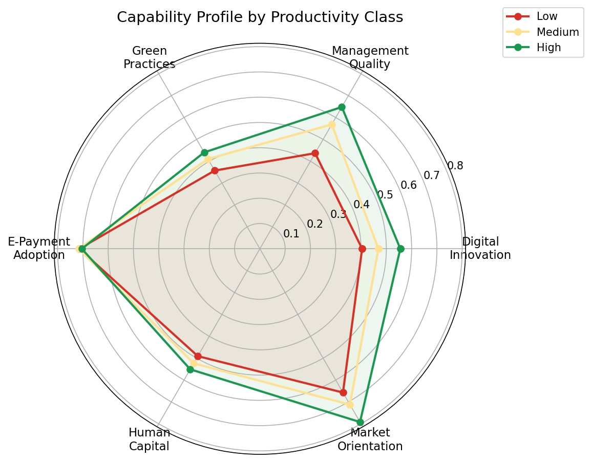
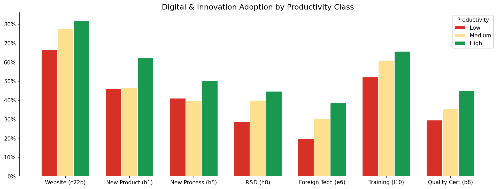
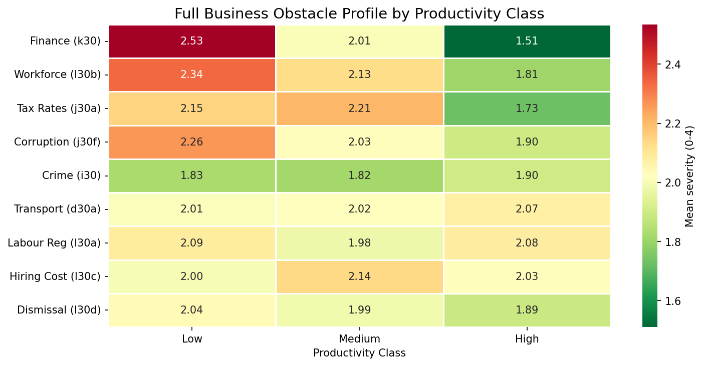
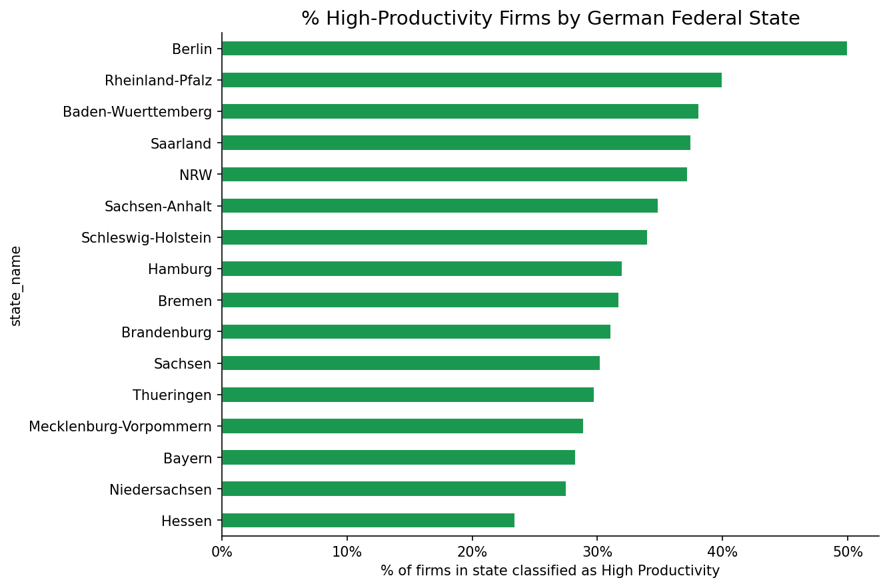
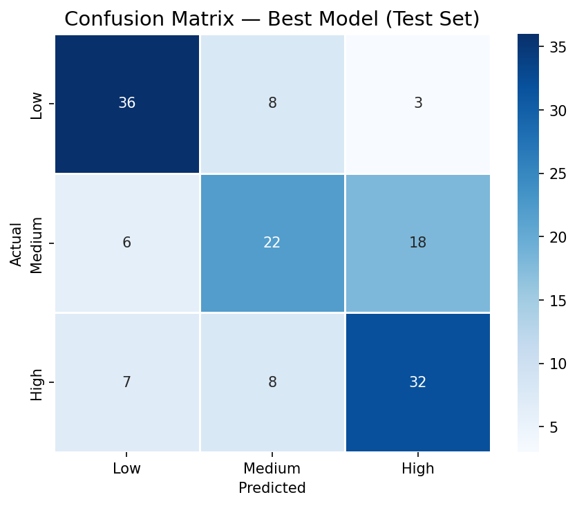
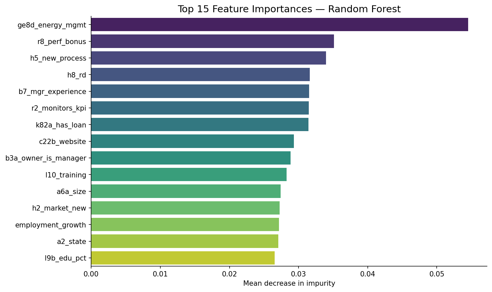

# SME Productivity Predictor: WBES Germany 2025 (v3)

Predicting SME productivity using **53 variables across 7 themes** from the World Bank Enterprise Survey Germany 2025 codebook (`DEU_2025_WBES_v01_M`).

Inspired by the BMBF-funded **HaMiZu** project on digital transformation and SME productivity.

---

## Quick Start

```bash
pip install -r requirements.txt

# Run immediately on synthetic data
jupyter notebook

# Switch to real WBES data (no code changes needed)
# 1. Download CSV from https://microdata.worldbank.org/index.php/catalog/8258
# 2. Place at: data/raw/DEU_2025_WBES_v01_M.csv
# 3. Run notebooks: loader switches automatically
```

---

## Variable Coverage (53 variables, 7 themes)

| Theme | Variables | Key WBES Codes |
|---|---|---|
| **Core** | Firm size, age, sales growth, employment growth | `l1`, `b5`, `d2`, `n3` |
| **Digital & Innovation** | Website, R&D, new products, new processes, foreign tech | `c22b`, `h8`, `h1`, `h5`, `e6` |
| **Management Quality** | KPI monitoring, targets, bonuses, quality certification | `r2`, `r4`, `r8`, `b8` |
| **Green / Sustainability** | CO2 monitoring, energy management, solar panels | `ge7`, `ge8d`, `c43` |
| **Market & Competition** | Market scope, export share | `e1`, `d3c` |
| **Finance** | Internal funding, bank debt, e-payments, audit | `k3a`, `k3bc`, `k33`, `k21` |
| **Labour** | Training rates, women's share, part-time share | `l10`, `l11a`, `l12a`, `l5` |
| **Regulation & Obstacles** | 9 business obstacles, tax hours, labour regs | `k30`, `l30b`, `j30a`, `j35` |
| **German-specific** | 16 Bundesländer, city size, legal form | `a2`, `a3`, `b1_GER` |

---

## ML Pipeline

| Step | Detail |
|---|---|
| **Target** | Capacity utilisation (`f1`) → Low / Medium / High tercile |
| **Models** | Logistic Regression · Random Forest · Gradient Boosting |
| **Validation** | Stratified 5-fold cross-validation |
| **Metrics** | Accuracy · F1-macro · F1-weighted · Confusion Matrix |
| **Explainability** | SHAP TreeExplainer (per-class feature impact) |
| **Interactions** | 9 composite indices (digital score, management index, green score, etc.) |

---

## Notebooks

| Notebook | Content |
|---|---|
| `01_eda.ipynb` | Distribution, radar chart, 9 obstacle heatmap, state map, correlation matrix |
| `02_preprocessing.ipynb` | Feature groups, interaction terms, train/test split |
| `03_modeling.ipynb` | CV comparison, confusion matrix, feature importance, SHAP |
| `04_insights.ipynb` | Policy recommendations per theme |


---

## Sample Visualisations

### Capability Profile by Productivity Class
High-productivity firms consistently score higher across digital innovation, management quality, market orientation, and green practices.



### Digital & Innovation Adoption
Website, R&D, and quality-certification adoption rise sharply with productivity.



### Business Obstacle Profile
Finance and workforce obstacles weigh most heavily on Low-productivity firms.



### Productivity by German Federal State


### Model Performance
Random Forest confusion matrix and top feature importances on the held-out test set.





---

## Interactive Dashboard

An interactive Streamlit app for entering a firm profile and receiving a live productivity prediction, with additional tabs for visual data exploration.

```bash
pip install -r requirements.txt
streamlit run app.py
```

The app has three tabs:
- **Predict** : adjust sliders and toggles for a firm profile and see the predicted productivity class with confidence bars
- **Explore** : interactive charts of adoption rates by productivity class
- **About** : project background and data source

**Live demo:** [nia-sme-predictor.streamlit.app](https://nia-sme-predictor.streamlit.app)

The app is deployed on Streamlit Community Cloud, so it can be used directly in the browser with no setup.

---

## Author
Nia Kharaishvili | [github.com/niakharaishvili](https://github.com/niakharaishvili)
